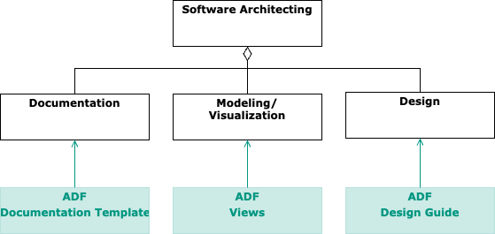

{: .translation }
This page has been machine-translated and has not yet been reviewed. Parts of its content may be incomplete or incorrect.

# About the ADF

Architecture work (*architecture work*) encompasses several activities such as **documenting** (creating an architecture documentation), **modeling/visualizing** (using diagrams that show views of the system), and **designing** systems (or parts of them)[^1].

These activities overlap in content and time. For example, architecture diagrams (*visualization*) often arise during architecture design and are included in the architecture documentation. This page describes how the Architecture Decomposition Framework supports architecture work.

- The **ADF documentation template** provides a sensibly structured outline for an architecture documentation, covering the usual architecture topics and can be easily edited with simple tools (Markdown in a text editor or IDE) [→ Documentation area](documentation/).

- The **ADF views** offer a system decomposition along various dimensions and define tailored view types and appropriate elements, so that the viewer immediately understands which aspect of a system is being described (similar to how an architect of a house immediately understands what to expect in a floor plan), [→ Modeling/Visualization area](views/).

- The **ADF design guide** provides general guidelines on how to approach architecture design, [→ Design](/pages/design.html).

## Who uses the ADF?

The ADF has been used in many industrial and research projects from various fields. It originates from the [Fraunhofer IESE Institute](https://www.iese.fraunhofer.de/) and is taught at the [Fraunhofer Academy](https://www.academy.fraunhofer.de/de/weiterbildung/information-kommunikation/softwarearchitektur.html), the [HTWG Konstanz](https://www.htwg-konstanz.de/hochschule/fakultaeten/informatik/uebersicht/), and the [Hochschule Mannheim](https://www.informatik.hs-mannheim.de/).

[^1]: Another activity is architecture review, more on this can be found in the book [Pragmatic Evaluation of Software Architectures (J. Knodel, M. Naab)](https://doi.org/10.1007/978-3-319-34177-4)
