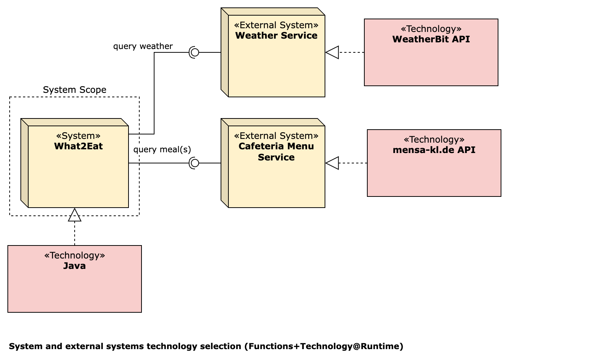
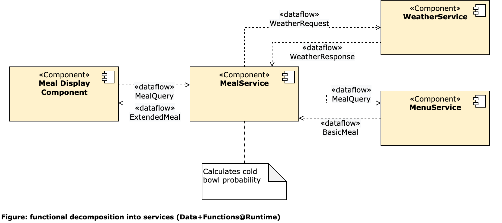
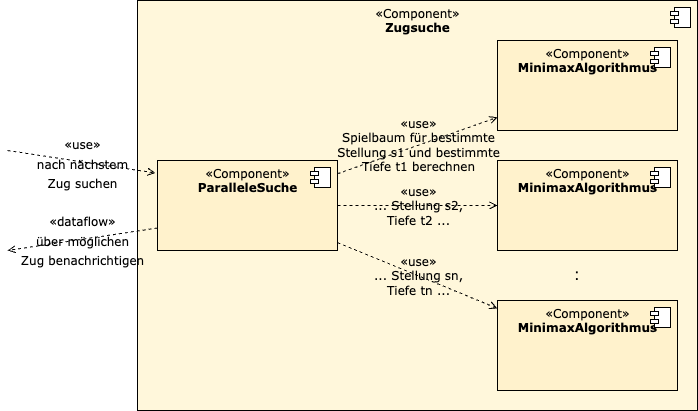

{: .translation }
This page has been machine-translated and has not yet been reviewed. Parts of its content may be incomplete or incorrect.

<!-- markdownlint-disable-next-line blanks-around-headings -->
# Examples of ADF Views
{: .no_toc }

These views are taken from the [example documentations](../documentation/examples.html). More examples can be found there.

The labeling follows the scheme "Name of the view (Type of the view)".

<!-- markdownlint-disable-next-line blanks-around-headings -->
## Content
{: .no_toc }

- TOC
{:toc}

## What2Eat: System Context Diagram (Functions@Runtime)

## What2Eat: Technology Selection for the Systems (Technology@Runtime)

## What2Eat: Decomposition into Services (Data+Functions@Runtime)

## DokChess: Move Search Component (Functions@Runtime)

## DokChess: Important Data Types (Data@Devtime)

## DokChess: Code Structure (Functions@Devtime)

## What2Eat: Deployment-Driven Decomposition (Deployment@Runtime)

## GitLab-CI: Build Process Backend (Deployment+Activities@Devtime)

## Digital Villages: Many More Examples

The ADF can also be used on the whiteboard. More examples from the "Digital Villages" project can be found in this [blog article](https://www.iese.fraunhofer.de/blog/softwarearchitekturen-einfacher-designen-und-verstaendlicher-dokumentieren-mit-dem-fraunhofer-adf/#Beispiele).
