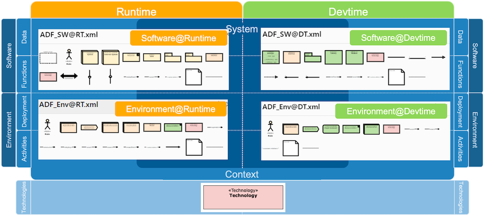
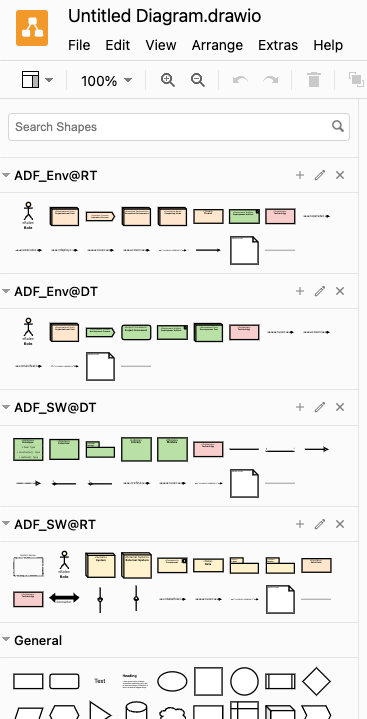

# ADF elements for Diagrams.net

[Diagrams.net (formerly known as draw.io)](https://www.diagrams.net/) is a popular Open Source diagramming tool that can be used in the browser or as a desktop application.
We are providing a set of ADF elements for Diagrams.net that can be used to create architecture diagrams in the ADF style. The elements are organized in libraries for different types of views:



To use the palettes, go to the [ADF-Diagrams.net repository](https://github.com/architecture-decomposition-framework/adf-diagramsnet), download the four XML file from the libraries directory and import them into the Diagrams.net via "File -> Open Library...". Alternatively, you can click [this link](https://app.diagrams.net/?splash=0&libs=general&clibs=Uhttps%3A%2F%2Fraw.githubusercontent.com%2Farchitecture-decomposition-framework%2Fadf-diagramsnet%2Fmain%2Flibraries%2FADF_SW%40RT.xml;Uhttps%3A%2F%2Fraw.githubusercontent.com%2Farchitecture-decomposition-framework%2Fadf-diagramsnet%2Fmain%2Flibraries%2FADF_Env%40RT.xml;Uhttps%3A%2F%2Fraw.githubusercontent.com%2Farchitecture-decomposition-framework%2Fadf-diagramsnet%2Fmain%2Flibraries%2FADF_SW%40DT.xml;Uhttps%3A%2F%2Fraw.githubusercontent.com%2Farchitecture-decomposition-framework%2Fadf-diagramsnet%2Fmain%2Flibraries%2FADF_Env%40DT.xml) to launch Diagrams.net in your browser with all palettes already loaded.

.

## Documentation-as-code, embed Diagrams.net figures into markdown

{: .highlight }
Diagrams.net that is highly compatible with the Documentation-as-code workflow, since it can save diagrams as SVG and PNG files with the diagram itself embedded. Thus, we can open the SVG (or PNG) file, edit the diagram, and both the SVG (or PNG) and the embedded diagram is updated when saved. Consequently, there is no need of an additional "generate SVG (or PNG) file" step - we can immediately embed the SVG (or PNG) into the markdown file.

This is particularly handy when used in combination with Diagrams.net integrations into your IDE. Follow the Installation and Configuration steps below to set up Diagrams.net with e.g. VS Code.

With the plugin set up, you can create a new file `diagram.drawio.png` (or `diagram.drawio.svg`), open it with the diagrams.net plugin in your IDE, draw your diagram, and save it. In your markdown file, you can then embed the diagram with the following code:

```markdown

```

All the diagrams in [this example documentation](https://github.com/neshanjo/what2eat/blob/with-cache/doc/architecture-documentation.md) are created and embedded this way (see [source code](https://raw.githubusercontent.com/neshanjo/what2eat/refs/heads/with-cache/doc/architecture-documentation.md)).

### Installation

Diagrams.net runs without installation in any web browser and can be installed as desktop application, however, we recommend to use one of the (unofficial) IDE plugins to be able to edit the diagrams without leaving the IDE.

 [Visual Studio Code](https://code.visualstudio.com/) is great for Markdown editing, because there are some excellent plugins that support creating the documentation:

- [Markdown All in One](https://marketplace.visualstudio.com/items?itemName=yzhang.markdown-all-in-one) lets you autogenerate section numbers and content tables, both features that Markdown unfortunately does not support itself
- [markdownlint](https://marketplace.visualstudio.com/items?itemName=DavidAnson.vscode-markdownlint) makes sure that your documents follow a typical style (like blank lines before and after headings, etc.)
- [Draw.io integration](https://marketplace.visualstudio.com/items?itemName=hediet.vscode-drawio) lets you edit your diagrams directly in the IDE. To add a new one, just create a new file *somename*.drawio.svg (or *somename*.drawio.png) and open it with the plugin. It will always update the generated SVG (or PNG) with your diagram.
- [Code Spell Checker](https://marketplace.visualstudio.com/items?itemName=streetsidesoftware.code-spell-checker) helps you with the spelling (optionally install support for other languages as well)

{: .hint-title }
> IntelliJ
>
> There is also a [Diagrams.net plugin for IntelliJ IDEA](https://plugins.jetbrains.com/plugin/15635-diagrams-net-integration). However, it does not support custom tool libraries. As a workaround, you can download [this file](https://github.com/architecture-decomposition-framework/adf-diagramsnet/blob/main/source/ADF.drawio), open it in IntelliJ and copy and paste the elements you need.
>
> You might also want to set [soft wrap for Markdown files](assets/intellij-markdown-softwrap.png) in IntelliJ and configure [some useful setting for the markdown editor](pages/views/tooling/assets/intellij-markdown-editor-settings.png).

### Configure ADF tool libraries

To configure the [ADF tool libraries for diagrams.net](https://github.com/architecture-decomposition-framework/adf-diagramsnet) with the VS Code plugin, you have to download the xml file from the *libraries* directory to your computer and then configure them in the VS Code settings.json:

```json
  "hediet.vscode-drawio.customLibraries": [
    {
      "file": "c:\\Misc\\adf-diagramsnet\\libraries\\ADF_SW@RT.xml",
      "libName": "ADF SW@RT"
    },
    {
      "file": "c:\\Misc\\adf-diagramsnet\\libraries\\ADF_Env@RT.xml",
      "libName": "ADF Env@RT"
    },
    {
      "file": "c:\\Misc\\adf-diagramsnet\\libraries\\ADF_SW@DT.xml",
      "libName": "ADF SW@DT"
    },
    {
      "file": "c:\\Misc\\adf-diagramsnet\\libraries\\ADF_Env@DT.xml",
      "libName": "ADF Env@DT"
    }
  ]
```

Note that this is an example configuration for a Windows machine. Replace the paths with the correct ones for your computer.

Note that if only one of the file does not exist or the configuration has some error, the Diagrams.net plugin won't start at all. **So double check everything!**

{: .hint-title }
> Important
>
> The plugin has a **quirk**: It does not show the ADF palettes unless you once click on the ["More shapes"](assets/more_shapes.png) button, followed by "Apply" in the opened dialog. After that, the ADF palettes are shown.

### Working with dark mode

Developers often use a dark theme for there IDE. This setting is also respected by the Diagrams.net plugin in VS Code which then renders the diagrams different from they look on the Git server (in light mode).

The recommended approach is to use a light theme for the Diagrams.net plugin only by configuring

```json
  "hediet.vscode-drawio.theme": "Kennedy",
```

in the settings.json of VS Code.

Also, diagrams with transparent background might look unreadable when viewed in dark mode. Therefore make sure, that in every diagram, the background is set to white as demonstrated in [this screenshot](assets/digramsnet_darkmode_fix.png).
