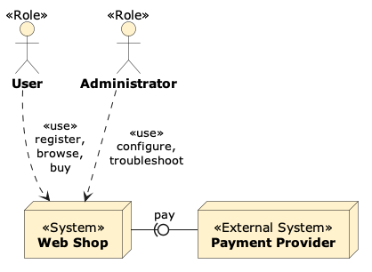

# diagrams-as-code with PlantUML

With [PlantUML](https://plantuml.com/), you can write diagrams as code. Despite its name, PlantUML does not only support UML, but also a variety of other diagram types and can be customized with your own elements.

Diagrams-as-code has several advantages:

- **Version control**: Diagrams are stored as text files, which can be versioned with Git or any other version control system. It is easy to see from the text diff what has changed in a diagram.
- **Focus on the model**: The focus is on the content (elements and their relation), not on the layout. PlantUML automatically arranges the elements in the diagram, which can save a lot of time.
- **Documentation-as-code**: Diagrams can be embedded directly into the documentation, which is particularly handy when using a Documentation-as-code workflow.

That said, two things are important to note: The initial learning curve is a bit steeper than with GUI-based tools, and the auto-layouting can sometimes be a bit tricky to work with, particularly with larger diagrams.

## ADF-Elements for PlantUML

We have defined all the elements from the ADF in PlantUML, so you can use them in your diagrams.

[ADF-PlantUML Repository](https://github.com/architecture-decomposition-framework/adf-plantuml){: .btn }

Here is an example diagram (System-Context-Diagram with ADF-Elements), created with PlantUML:



The code for this diagram looks like this:

```plantuml-code
@startuml example1
!include https://raw.githubusercontent.com/architecture-decomposition-framework/adf-plantuml/refs/heads/main/ADF.puml

ADFRole(user, "User")
ADFRole(admin, "Administrator")

ADFSystem(ws, "Web Shop")
ADFExternalSystem(pp, "Payment Provider")

ADFRelation(admin, ws, "use", "configure,\ntroubleshoot")
ADFRelation(user, ws, "use", "register,\nbrowse,\nbuy")

pp -left0)- ws : "pay"
@enduml
```

You can try this code in the [PlantUML online editor](https://www.plantuml.com/plantuml/uml/SyfFKj2rKt3CoKnELR1Io4ZDoSa70000). For an offline workflow, you can download the ADF.puml file from the [ADF-PlantUML Repository](https://github.com/architecture-decomposition-framework/adf-plantuml), put it in the same directory as your PlantUML file, and include it with `!include ADF.puml`.

## PlantUML and Markdown - Documentation-as-code

There are basically two options to include PlantUML diagrams in your markdown documentation:

1. **Separate puml file**: You can write the PlantUML code in a separate file with the `.puml` extension (e.g. `diagram.puml`), manually convert it to an image (e.g. `diagram.png`) and include it in your markdown file (with ``). This is useful if you want to keep the diagram source code separate from your documentation source code. The conversion step can also be automated via the command line or within a CI/CD pipeline (basically calling `plantuml *.puml` in the directory with the `puml`-Files).

2. **Embed PlantUML code**: You can embed the PlantUML code directly in your markdown file using `plantuml` code blocks. For an example, see [this source code](assets/embedded-plantuml.txt). This is useful if you want to keep the diagram source code together with your documentation. Note that the current GitHub version does not support rendering PlantUML code blocks when processing Markdown files, so you have to add this step to the CI/CD pipeline. The script [replace_plantuml.py](assets/replace_plantuml.py) might be helpful for this (check the code first and use it at your own risk).

## Working with PlantUML in VS Code

First, you need to install the [VS Code PlantUML extension](https://marketplace.visualstudio.com/items?itemName=jebbs.plantuml). Now, a preview is available for all `puml`-files. To enable rendering of inline plantuml-code-blocks in markdown files:

- Open VS Code settings
- Search for "Plantuml"
  - Set "Plantuml: Render" to "Server"
  - Set "Plantuml: Server" to the path of the official server (<https://www.plantuml.com/plantuml>)
  - Note: All diagrams will now be sent to the server! This might not be what you want if your project is confidential. For sensitive projects, or if you want to work offline, you can install the PlantUML command line tool (`brew install plantuml` on MacOS), set the server to "Local", run the command `plantuml -picoweb` in a terminal (starts a local server), and set the server path to `http://localhost:8080`.

For using the ADF-Elements, you can simply `!include https://raw.githubusercontent.com/architecture-decomposition-framework/adf-plantuml/refs/heads/main/ADF.puml` in your PlantUML file/code.

To make `!include ADF.puml` work for a local copy of the ADF.puml file, you have to configure the PlantUML plugin to look for the file in the correct directory:

- Choose View -> Command Palette, then type "> User Preferences (JSON)" and select it.
- add the following:

    ```json
    "plantuml.includepaths": [
        "/path/to/directory/with/file/"
    ],
    ```

    Adjust the path to point to the directory where the ADF.puml file is located.

## Generate documentation site with PlantUML diagrams

Several site generators can produce a complete documentation site from Markdown code and also support PlantUML conversion. See [mkdocs-with-plantuml](https://github.com/neshanjo/mkdocs-with-plantuml) for an example using MkDocs configured with the `plantuml_markdown` extension and `build_plantuml` plugin.

There is also support for PlantUML in Jekyll, see e.g. the third-party plugin [jekyll-plantuml](https://github.com/RichDom2185/jekyll-plantuml) (this plugin has not been tested by the author of this documentation).
